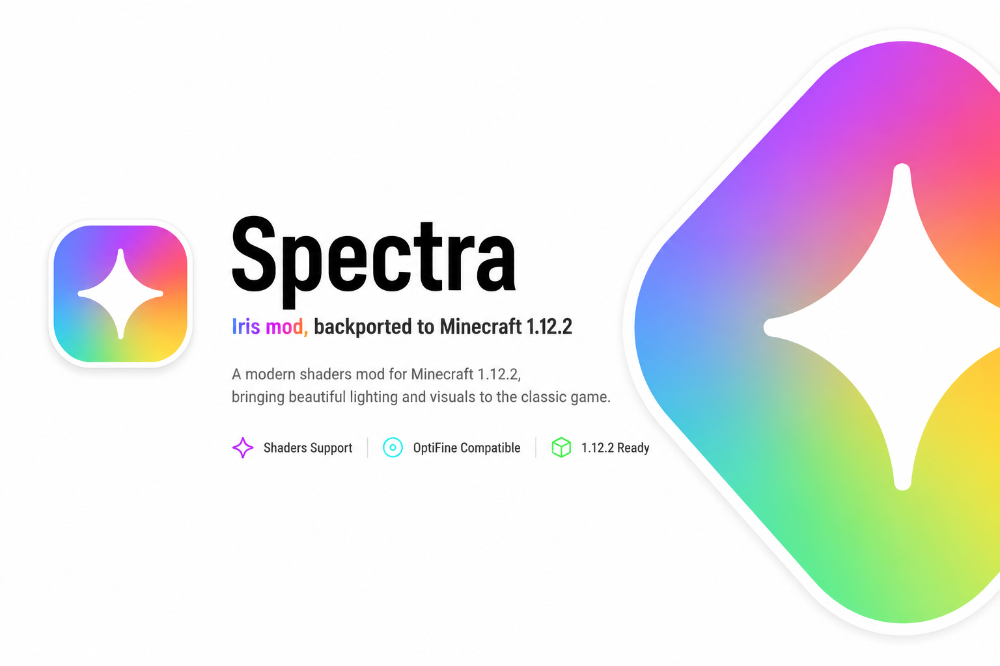

<p align="center">
  
</p>

# Spectra

Spectra is an experimental backport of the Iris/Oculus shader system for **Minecraft Forge 1.12.2**.

The goal of Spectra is to bring modern shader support to legacy Forge modpacks while maintaining compatibility with the Minecraft 1.12.2 modding ecosystem.

> ⚠️ Spectra is currently in **Alpha** and under active development.

---

## Disclaimer
- This mod requiere Mixin Booter and Vintagium
- Spectra is **not** compatible with OptiFine.
- This project is based on the work of the **Iris** and **Oculus** developers.
- Expect bugs and unfinished features.

---

## Dependencies

Required:

- Minecraft Forge 1.12.2
- Vintagium
- MixinBooter

Temporary runtime dependency:

- Apache Commons Collections 4.4 (PatriciaTrie fix)

---

## Features

- Modern Iris/Oculus rendering pipeline backported to Minecraft 1.12.2
- ShaderPack loading
- Designed for Forge modpacks
- Based on the Oculus codebase
- Open-source

---

## Fixed

✔ Initial Iris/Oculus backport to Minecraft 1.12.2

✔ Fixed multiple compilation issues

✔ Fixed missing `PatriciaTrie` crash

✔ Fixed numerous dependency issues

✔ Shader pipeline initializes correctly

✔ ShaderPack loading implemented

✔ General compatibility improvements

---

## Known Issues

- Shader selection GUI is not finished
- Some shaderpacks may fail to initialize
- Apple Silicon / macOS OpenGL compatibility is incomplete
- Windows and Linux require further testing
- Additional compatibility fixes are still needed

---

## OS Support

| Operating System | Status |
|-----------------|--------|
| Windows | 🟡 Experimental |
| Linux | 🟡 Experimental |
| macOS Intel | 🟡 Untested |
| macOS Apple Silicon | 🔴 Broken (OpenGL limitations) |

---

## Installation

1. Install Minecraft Forge 1.12.2
2. Install Vintagium
3. Install MixinBooter
4. Place Spectra into your `mods` folder
5. Launch Minecraft

---

## Building

```bash
./gradlew clean build
```

The compiled JAR will be located in:

```text
build/libs/
```

---

## Credits

- Iris Shaders Team
- Oculus
- Asek3
- Coderbot
- Minecraft Forge
- SpongePowered Mixin

Special thanks to everyone who contributed to the original Iris and Oculus projects.

---

## License

Spectra is based on Oculus and Iris.

Please respect the original project license and the work of its contributors.
